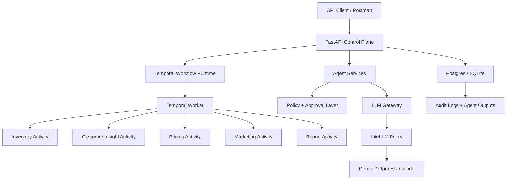

# Agentic E-Commerce Operations Manager

Backend-first AI operations manager for an online store. The system monitors inventory, recommends pricing changes, surfaces product issues from reviews/returns, drafts marketing campaigns, gates risky actions through approvals, and generates a structured daily operations report.

The implementation is intentionally production-oriented:

```text
LLM recommends or summarizes
Policy validates
Workflow executes
Human approves risky actions
Database remains the source of truth
```

## What This Demonstrates

- Multi-agent e-commerce operations architecture.
- FastAPI backend with typed Pydantic contracts.
- SQLAlchemy/Postgres persistence with Alembic migrations.
- Temporal durable workflow execution with per-agent activities.
- LiteLLM-compatible gateway for Gemini/OpenAI/Claude-style provider routing.
- Prompt registry, deterministic fallback, and prompt evals.
- Human approval workflow for high-risk mutations.
- Audit logs and workflow node observability.
- Demo mutation APIs for live interview scenarios.
- Postman collection for API walkthroughs.

## Architecture



## Tech Stack

| Area | Choice |
|---|---|
| API | FastAPI |
| Contracts | Pydantic |
| ORM | SQLAlchemy |
| Migrations | Alembic |
| Database | Postgres in Docker, SQLite for local fallback/tests |
| Workflow Runtime | Temporal |
| LLM Gateway | LiteLLM-compatible gateway |
| Tests | Pytest |
| Deployment | Docker Compose |

## Agents

| Agent | Responsibility | LLM Usage |
|---|---|---|
| Inventory Agent | Calculates reorder recommendations from stock, sales velocity, lead time, and safety stock | Deterministic rules |
| Pricing Agent | Recommends price changes using competitor signals and demand, then applies policy checks | Deterministic policy-first |
| Customer Insight Agent | Clusters reviews/returns into product issues with evidence | LLM-assisted semantic clustering with deterministic fallback |
| Marketing Agent | Drafts campaign copy for products while blocking risky promotions | LLM-assisted drafting |
| Orchestrator | Coordinates agents and builds the daily operations report | LLM-assisted executive summary |

## Repository Structure

```text
app/
  api/                  FastAPI routes
  database/             SQLAlchemy models, sessions, seed data
  ecommerce_ops/        agents, contracts, policies, workflows, repositories
  evals/                prompt evaluation runner
  llm/                  prompt registry, gateway, cache
  security/             API key auth and text sanitizer
  temporal/             Temporal activities, workflow, worker
docs/
  api/                  Postman collection
  interview-package/    architecture, runbook, walkthrough, tradeoffs
evals/                  prompt eval suites
migrations/             Alembic migrations
prompts/                versioned prompt configs
tests/                  pytest suite
```

## Quick Start With Docker

Create environment values:

```bash
cp .env.example .env
```

For an offline deterministic demo, keep:

```env
LLM_GATEWAY_PROVIDER=prompt
```

Run the full stack:

```bash
docker compose up --build
```

Services:

```text
FastAPI:      http://localhost:8000
API Docs:     http://localhost:8000/docs
LiteLLM:      http://localhost:4000
Temporal UI:  http://localhost:8080
Temporal RPC: localhost:7233
Postgres:     localhost:5432
```

If schema or seed data changes, reset local containers:

```bash
docker compose down -v
docker compose up --build
```

## Local Python Setup

```bash
python3 -m venv .venv
.venv/bin/python -m pip install -r requirements.txt
.venv/bin/python -m alembic upgrade head
.venv/bin/python -c "from app.database.init_db import seed_database; seed_database()"
.venv/bin/python -m uvicorn app.main:app --reload
```

## Environment Variables

| Variable | Purpose | Default |
|---|---|---|
| `DATABASE_URL` | App database URL | `sqlite:///./ecommerce_ops.db` locally |
| `ECOMMERCE_OPS_API_KEY` | Enables `X-API-Key` protection when set | empty |
| `LLM_GATEWAY_PROVIDER` | `prompt` or `litellm` | `prompt` |
| `LITELLM_BASE_URL` | LiteLLM proxy URL | `http://localhost:4000` |
| `LITELLM_API_KEY` | LiteLLM proxy key | `sk-local-litellm` in Compose |
| `GEMINI_API_KEY` | Gemini key used by LiteLLM mappings | empty |
| `OPENAI_API_KEY` | OpenAI key if mappings use OpenAI | empty |
| `ANTHROPIC_API_KEY` | Anthropic key if mappings use Anthropic | empty |
| `TEMPORAL_ADDRESS` | Temporal frontend address | `localhost:7233` |
| `TEMPORAL_NAMESPACE` | Temporal namespace | `default` |
| `TEMPORAL_TASK_QUEUE` | Temporal worker task queue | `ecommerce-ops-task-queue` |

## Running The Demo

Health check:

```bash
curl http://localhost:8000/api/v1/ecommerce-ops/health
```

If `ECOMMERCE_OPS_API_KEY=change-me`, protected endpoints require:

```bash
-H "X-API-Key: change-me"
```

Run the direct daily workflow:

```bash
curl -X POST http://localhost:8000/api/v1/ecommerce-ops/workflows/daily-ops/run \
  -H "Content-Type: application/json" \
  -H "X-API-Key: change-me" \
  -d '{"run_id":"demo-happy-flow","workflow_run_id":"demo-happy-flow","channels":["email"],"lookback_days":30}'
```

Start the Temporal-backed workflow:

```bash
curl -X POST http://localhost:8000/api/v1/ecommerce-ops/workflows/daily-ops/temporal/start \
  -H "Content-Type: application/json" \
  -H "X-API-Key: change-me" \
  -d '{"run_id":"demo-temporal-flow","workflow_run_id":"demo-temporal-flow","channels":["email"],"lookback_days":30}'
```

Open Temporal UI:

```text
http://localhost:8080
```

## Live Demo Mutations

Add a bad review:

```bash
curl -X POST http://localhost:8000/api/v1/ecommerce-ops/reviews \
  -H "Content-Type: application/json" \
  -H "X-API-Key: change-me" \
  -d '{"review_id":"REV-DEMO-BATTERY","sku":"SKU-1003","rating":1,"title":"Power dies quickly","body":"The backpack accessory battery does not hold charge.","created_at":"2026-05-20T10:00:00Z"}'
```

Make inventory critical:

```bash
curl -X PATCH http://localhost:8000/api/v1/ecommerce-ops/inventory/SKU-1003 \
  -H "Content-Type: application/json" \
  -H "X-API-Key: change-me" \
  -d '{"warehouse":"DEL-02","available_stock":1,"reserved_stock":1,"reorder_point":35,"supplier_lead_time_days":5,"safety_stock":18,"status":"critical"}'
```

Add a competitor price:

```bash
curl -X POST http://localhost:8000/api/v1/ecommerce-ops/competitors \
  -H "Content-Type: application/json" \
  -H "X-API-Key: change-me" \
  -d '{"sku":"SKU-1003","competitor":"BagOutlet","price":1799,"product_url":"https://example.com/bagoutlet/urbantrail-backpack","observed_at":"2026-05-20T10:10:00Z","confidence":0.96}'
```

Then rerun the relevant agent or daily workflow to show changed output.

## Postman Collection

Import this file into Postman:

```text
docs/api/ecommerce-ops.postman_collection.json
```

Collection variables:

```text
base_url = http://localhost:8000
api_key = change-me
approval_id = replace-with-approval-id
```

## Tests

Run all tests:

```bash
.venv/bin/python -m pytest
```

Run prompt evals:

```bash
.venv/bin/python -m app.evals.run_evals
```

Current validation target:

```text
87 pytest tests passing
```

## Interview Documents

- `docs/interview-package/architecture.md`
- `docs/interview-package/api-walkthrough.md`
- `docs/interview-package/runbook.md`
- `docs/interview-package/tradeoffs.md`
- `docs/api/ecommerce-ops.postman_collection.json`

## Production Notes

- Use managed Postgres and managed Temporal for production.
- Replace API-key auth with OAuth/JWT and role-based permissions.
- Replace in-memory LLM cache with Redis.
- Add OpenTelemetry traces and metrics.
- Add Shopify, email, CRM, and supplier connectors behind tool permission policies.
- Add Temporal schedules, retry policies, and dead-letter handling.
- Keep `.env`, local databases, virtualenvs, caches, and provider keys out of Git.